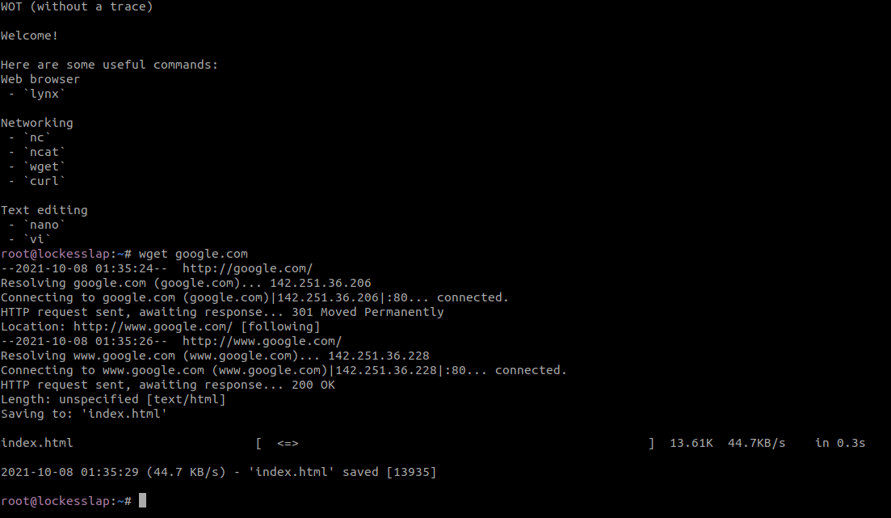
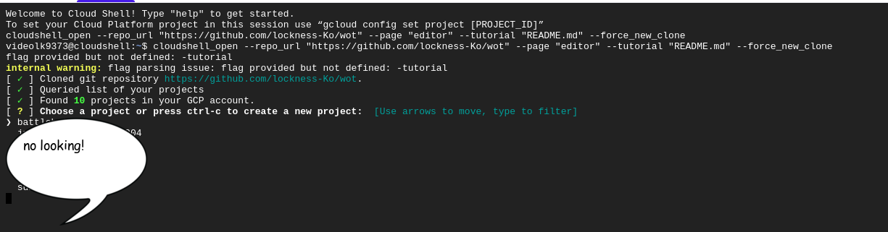
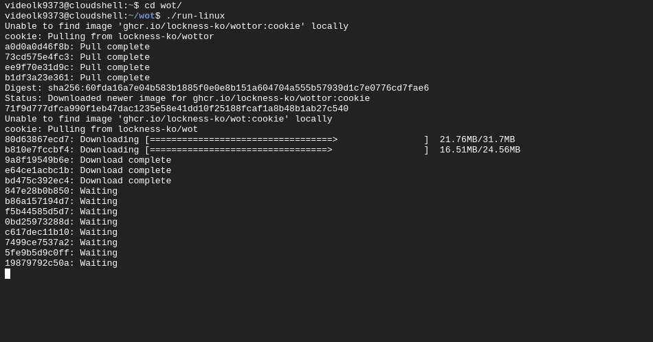

# WOT (without a trace)


Conduct forensic investigation of suspicious domains, websites and other dangerous thing without the fear of being infected! A docker image for hiding yourself using tor as a proxy :)




## > **Install** 

To install simply run clone the repo and type `docker build -t wot .`:

**YOU MUST HAVE TOR PROXY RUNNING ON PORT 9050 ON LOCALHOST FOR THE COFFEE VERSION**

```bash
cd /opt
git clone https://github.com/lockness-Ko/wot.git
cd wot
./run-linux
```

### > **Google Cloud Demo** 

Here is a cool button that you can use to have a go at this app in the google cloud shell!!

[](https://console.cloud.google.com/cloudshell/open?git_repo=https://github.com/lockness-Ko/wot&tutorial=TUTORIAL.md)

**DO NOT CHOOSE EPHEMERAL MODE (if possible) see [below](#NOTE) for details**

How to make it work:
 - When you first click the link, it will clone the repo and then ask you for a project. 
 - If you have a gcloud account already and a project setup, you can continue
 - Most people will not have an account, in this case just press Ctrl+C twice to exit out of the install and then follow the install instructions below:




## NOTE

The second time I tried this, the gcloud console worked and didn't ask for a project. I think the reason was that I was in ephemeral mode.

## > **Tools**

In the latest version (🧀 at this time) I have added some tools! Here is an updated list of tools with links to the github repos
 - [Osintgram](https://github.com/Datalux/Osintgram)	|	Instagram OSINT tool
 - [binwalk](https://github.com/ReFirmLabs/binwalk)		|	Reverse engineering tool
 - [twint](https://github.com/twintproject/twint)		|	Twitter OSINT tool

## > **Releases**

 - Version 1.0
   - wot ☕ `docker pull ghcr.io/lockness-ko/wot:coffee`
 - Version 1.1
   - wot 🍪 `docker pull ghcr.io/lockness-ko/wot:cookie`
   - wottor 🍪 `docker pull ghcr.io/lockness-ko/wottor:cookie`
 - Version 1.1 - Large
   - wot 🧂 `docker pull ghcr.io/lockness-ko/wot:salt`
 - Version 1.1 - raspberry pi!
   - wot 🍓 `docker pull ghcr.io/lockness-ko/wot:raspberry`
 - Version 1.2
   - wot 🧀 `docker pull ghcr.io/lockness-ko/wot:cheese`

To pull a release in docker run:

```bash
docker pull ghcr.io/lockness-ko/wot:release-name
```
