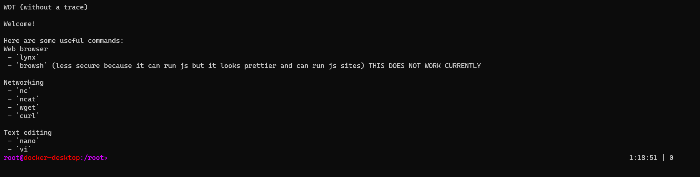

# WOT (without a trace)

A docker image for hiding yourself using tor as a proxy and disk encryption :)



## > **Install**

To install simply run clone the repo and type `docker build -t wot .`:

**YOU MUST HAVE TOR PROXY RUNNING ON PORT 9050 ON LOCALHOST**
Adding support for not needing it in the future :)

```bash
cd /opt
git clone https://github.com/lockness-Ko/wot.git
cd wot
./run
```

## > **Releases**

 - Version 1.0
   - coffee: `docker pull ghcr.io/lockness-ko:coffee`

To pull a release in docker run:

```bash
docker pull ghcr.io/lockness-ko:release-name
```
