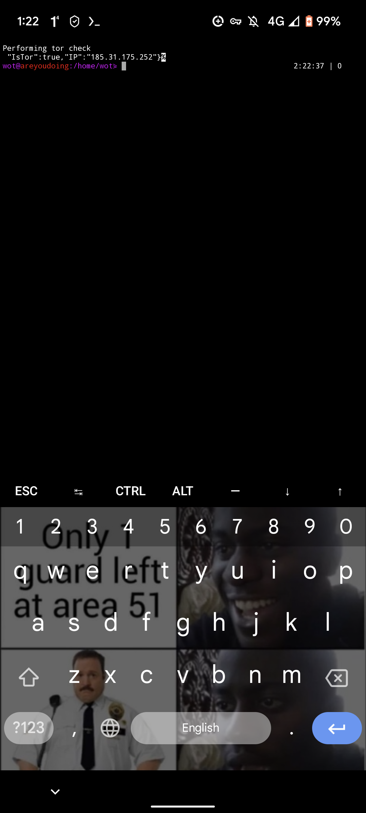

# WOT (without a trace) 


 
Conduct forensic investigation of suspicious domains, websites and other dangerous thing without the fear of being infected! A docker image for hiding yourself using tor as a proxy :)




## Important stuff
 - **DEPRECIATED** browsh either takes a long time to start or just doesn't work :/ [https://github.com/browsh-org/browsh/issues/121](https://github.com/browsh-org/browsh/issues/121)
 - You can now use tor onion urls! (I have upgraded the proxychains version)
  - This also allows you to access the tor proxy directly with the localhost:5090 localnet exclusion in the proxychains.conf file
  - `curl -v --proxy socks5h://127.0.0.1:5090 https://3g2upl4pq6kufc4m.onion` (curling the duckduckgo tor url)
  - Now you do not have to specify the socks proxy and just do `curl https://3g2upl4pq6kufc4m.onion`
 - Now running on archlinux (faster). You can still use the old versions that run on ubuntu, just supply a command line argument into run-linux with the version:
  - `./run-linux banana` (this is the newest, non-archlinux version)
 - Feel free to build

## > **Install** 

To install simply run clone the repo and type `./run-linux`

**YOU MUST HAVE TOR PROXY RUNNING ON PORT 9050 ON LOCALHOST FOR THE COFFEE VERSION**

```bash
cd /opt
git clone https://github.com/lockness-Ko/wot.git
cd wot
./run-linux
```

## > Build

If you want to build your own custom image (with whatever tools you want) go into the project root and type this:

```bash
docker build -t wot:tag .
```

(I recommend creating a fork, pulling the forked repo onto the google cloud shell and building it there as it is much faster than building it locally)

**YOU WILL HAVE TO EDIT THE docker-compose.yml FILE TO USE YOUR NEWLY BUILT VERSION**

## > Security/Vulnerability reporting!

WOT is only as secure as I make it with the knowlege I have. If you find anything, refer to SECURITY.md for the security policy! Any help in patching would be great too :)

## > WOT Linux

WOT Linux is a custom archlinux installation with:
 - All the features of the WOT docker image
 - More security 
   - you only have to trust your VM provider or your hardware (and the packages that come with WOT Linux, you can see them in wotos/profile/packages_x86_64.conf)
   - **TODO:** add disk encryption
   - Uses torctl and iptables to route all traffic through tor
   - **TODO:** Use torctl autowipe to wipe memory on shutdown (TBA: installing secure-delete)
 - **TODO:** Make custom archiso with setup script already on it

### Mobile installation

To get WOT working on mobile (android, sorry IOS users) I used [termux](https://play.google.com/store/apps/details?id=com.termux&hl=en_AU&gl=US) and ran these commands:
 - `pkg update`
 - `pkg install unstable-repo`
 - `pkg install qemu-system-x86_64`
 - `wget https://github.com/lockness-Ko/wot/releases/download/v2.1.1/wot-2.1.1-x86_64.iso`
 - `qemu-system-x86_64 -cdrom wot-2.1.1-x86_64.iso -boot d -m 3G -smp 5 -nographic`
   - This will bring up the bios menu
   - As soon as it comes up, press tab and type
   - ` console=ttyS0` (including the space at the start)
   - and press enter
   - this will print the entire boot process to the console and make it work

### IMPORTANT THINGS TO NOTE!
 - If you are installing this, please make sure you allocate as little space as you need as it is stored in the RAM
 - It is easiest to install on a VM 
   - Just pop the ISO into a VM
   - Customize the install script
   - Make the install script executable
   - Make torctl executable **IMPORTANT**
   - Run the installer!
 - The default password for root and the wot user is `areyoudoing`

For more detailed instructions, refer to the v2.1.0 release **this is where you can download the ISO if you do not want to build it**

### > **Google Cloud Demo** 

Here is a cool button that you can use to have a go at this app in the google cloud shell!!

[](https://console.cloud.google.com/cloudshell/open?git_repo=https://github.com/lockness-Ko/wot&tutorial=TUTORIAL.md)

**DO NOT CHOOSE EPHEMERAL MODE (if possible) see [below](#NOTE) for details**

How to make it work:
 - When you first click the link, it will clone the repo and then ask you for a project. 
 - If you have a gcloud account already and a project setup, you can continue
 - Most people will not have an account, in this case just press Ctrl+C twice to exit out of the install and then follow the install instructions below:


## NOTE

The second time I tried this, the gcloud console worked and didn't ask for a project. I think the reason that it wasn't working was that I was in ephemeral mode.

## > **Tools**

In the latest version (🧀 at this time) I have added some tools! Here is an updated list of tools with links to the github repos
 - **Currently not implemented!!!** [Osintgram](https://github.com/Datalux/Osintgram)	|	Instagram OSINT tool
 - [binwalk](https://github.com/ReFirmLabs/binwalk)		|	Reverse engineering tool
 - [twint](https://github.com/twintproject/twint)		|	Twitter OSINT tool

## > **Releases**

 - Version 1.0
   - wot ☕ `docker pull ghcr.io/lockness-ko/wot:coffee`
 - Version 1.1
   - wot 🍪 `docker pull ghcr.io/lockness-ko/wot:cookie`
   - wottor 🍪 `docker pull ghcr.io/lockness-ko/wottor:cookie`
 - Version 1.1 - Large
   - wot 🧂 `docker pull ghcr.io/lockness-ko/wot:salt`
 - Version 1.1 - raspberry pi!
   - wot 🍓 `docker pull ghcr.io/lockness-ko/wot:raspberry`
 - Version 1.2
   - wot 🧀 `docker pull ghcr.io/lockness-ko/wot:cheese`
 - Version 2.0.0!
   - wot 🍩 `docker pull ghcr.io/lockness-ko/wot:donut`

To pull a release in docker run:

```bash
docker pull ghcr.io/lockness-ko/wot:release-name
```
