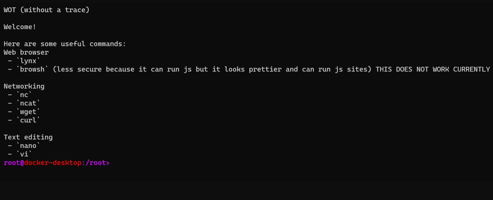

# WOT (without a trace)


A docker image for hiding yourself using tor as a proxy and disk encryption :)



## > **Install**

To install simply run clone the repo and type `docker build -t wot .`:

**YOU MUST HAVE TOR PROXY RUNNING ON PORT 9050 ON LOCALHOST FOR THE COFFEE VERSION**

```bash
cd /opt
git clone https://github.com/lockness-Ko/wot.git
cd wot
./run
```

## > **Releases**

 - Version 1.0
   - wot :coffee: `docker pull ghcr.io/lockness-ko/wot:coffee`
 - Version 1.1
   - wot :cookie: `docker pull ghcr.io/lockness-ko/wot:cookie`
   - wottor :cookie: `docker pull ghcr.io/lockness-ko/wottor:cookie`

To pull a release in docker run:

```bash
docker pull ghcr.io/lockness-ko/wot:release-name
```
