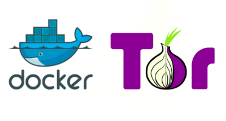

# Tutorial

This is for the gcloud console!

## > **Step 1 - What is wot?**

WOT (without a trace) is a small project of mine which allows for spawning of easy, private linux "machines". It does this by using docker, to very quickly spawn virtual "machines" ([__containers__](https://docs.microsoft.com/en-us/virtualization/windowscontainers/about/containers-vs-vm) actually), and [TOR](https://torproject.org/about/history) (the onion router), to anonymize yourself (on the network) wherever you are in the world. 



## > **Step 2 - Installation**

To install it, all you need is two things (both of which are already a part of the gcloud shell!):
 - Docker
 - An internet connection

First, lets have a look around. Type `ls`:

```bash
username@cloudshell:~/cloudshell_open/wot$ ls
bashrc      images   motd              README.md  run-windows.bat  TUTORIAL.md
Dockerfile  LICENSE  proxychains.conf  run-linux  tor
```

In the repo we can see a `Dockerfile` and a `tor` folder. The dockerfile is what we use to build the wot docker image and inside the tor folder is the dockerfile for the wottor image.

